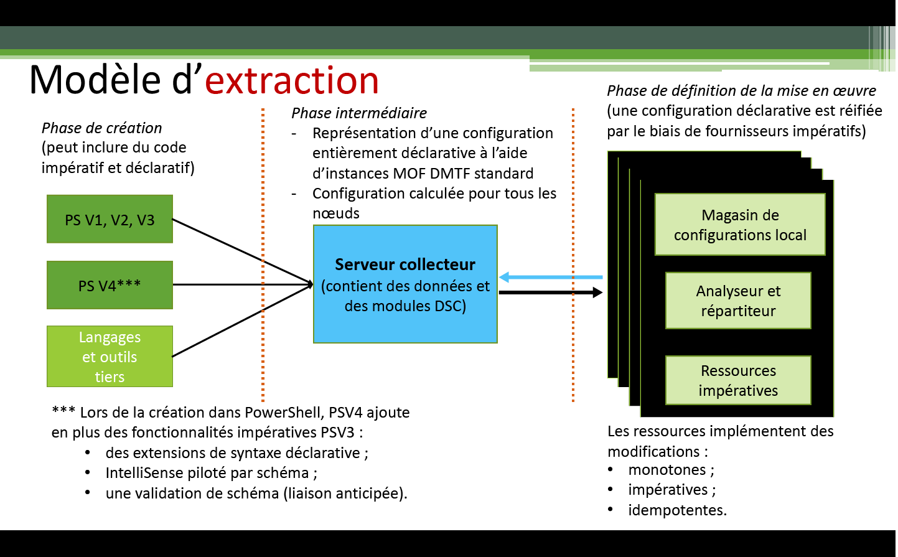

# Application des configurations

>S’applique à : Windows PowerShell 4.0, Windows PowerShell 5.0

Il existe deux façons de promulguer des configurations DSC PowerShell : le mode par envoi et le mode par extraction.

## Mode par envoi

Avec le mode par envoi, l’utilisateur applique activement une configuration à un nœud cible en appelant l’applet de commande [Start-DscConfiguration](https://technet.microsoft.com/en-us/library/dn521623.aspx).

Après la création et la compilation d’une configuration, vous pouvez la promulguer avec le mode par envoi en appelant l’applet de commande [Start-DscConfiguration](https://technet.microsoft.com/en-us/library/dn521623.aspx) et en définissant le paramètre -Path de l’applet de commande sur le chemin de la configuration MOF. Par exemple, si la configuration MOF se trouve à l’emplacement `C:\DSC\Configurations\localhost.mof`, vous pouvez l’appliquer à l’ordinateur local avec la commande suivante :`Start-DscConfiguration -Path 'C:\DSC\Configurations'`

> __Remarque__ : Par défaut, DSC exécute une configuration comme tâche en arrière-plan. Pour exécuter la configuration de manière interactive, appelez [Start-DscConfiguration](https://technet.microsoft.com/library/dn521623.aspx) avec le paramètre __-Wait__.

## Mode par extraction

Avec le mode par extraction, les clients d’extraction sont configurés de façon à obtenir leur configuration d’état souhaité à partir d’un serveur collecteur. De même, le serveur a été configuré pour héberger le service DSC et a été approvisionné avec les configurations et les ressources nécessaires par les clients d’extraction. Chacun des clients d’extraction est associé à une tâche planifiée qui effectue une vérification de conformité à intervalles réguliers sur la configuration du nœud. Quand l’événement est déclenché pour la première fois, le gestionnaire de configuration local sur le client d’extraction envoie une requête au serveur collecteur pour obtenir la configuration spécifiée dans le gestionnaire de configuration local. Si cette configuration existe sur le serveur collecteur et si les vérifications de validation initiales renvoient un résultat positif, la configuration est passée au client d’extraction, où elle est ensuite exécutée par le gestionnaire de configuration local.

Le gestionnaire de configuration local vérifie que le client est conforme à la configuration à intervalles réguliers, dont la fréquence est spécifiée par la propriété **ConfigurationModeFrequencyMins** du gestionnaire de configuration local. Le gestionnaire de configuration local vérifie la présence de configurations mises à jour sur le serveur collecteur à intervalles réguliers, dont la fréquence est spécifiée par la propriété **RefreshModeFrequency** du gestionnaire de configuration local. Pour plus d’informations sur la configuration du gestionnaire de configuration local, consultez [Configuration du gestionnaire de configuration local](metaConfig.md).

Pour plus d’informations sur la configuration d’un serveur collecteur DSC, consultez [Configuration d’un serveur collecteur web DSC](pullServer.md).

Si vous préférez utiliser un service en ligne pour héberger le serveur d’extraction, utilisez le service [Azure Automation DSC](https://azure.microsoft.com/en-us/documentation/articles/automation-dsc-overview/).

Les rubriques suivantes expliquent comment configurer les clients et les serveurs collecteurs :

- [Configuration d’un serveur collecteur web](pullServer.md)
- [Configuration d’un serveur collecteur SMB](pullServerSMB.md)
- [Configuration d’un client d’extraction](pullClientConfigID.md)

